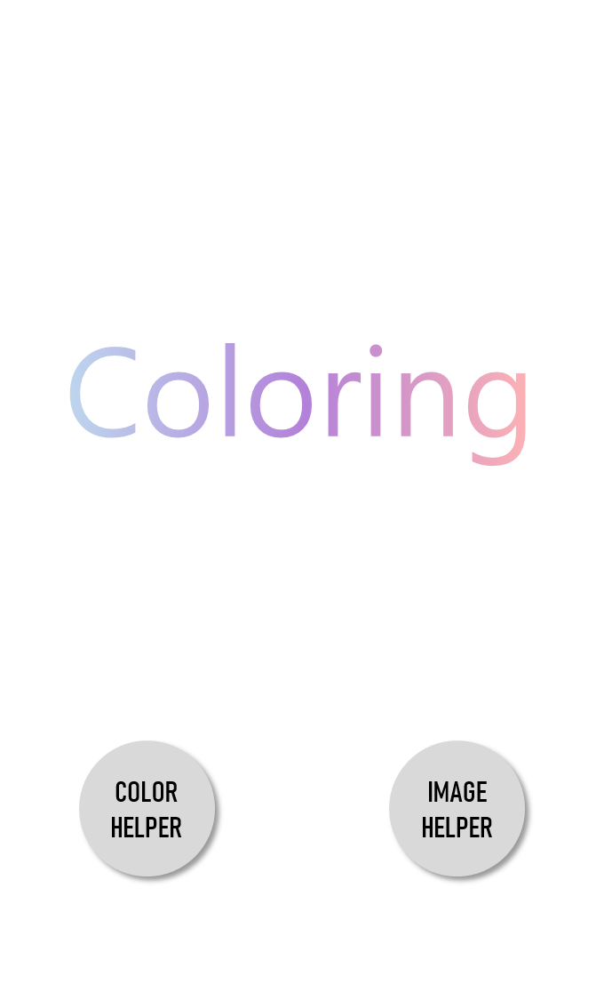
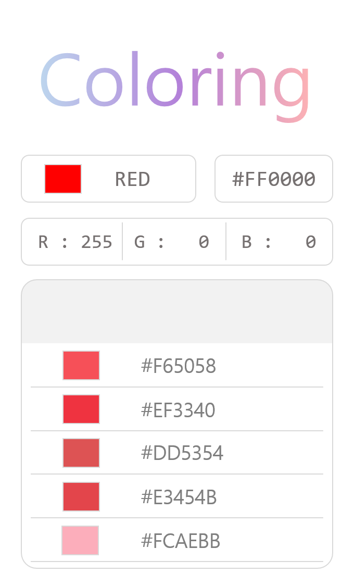
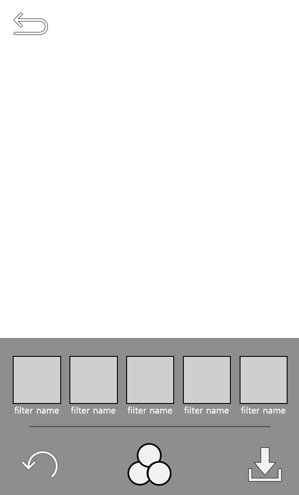

# Server

This codes are Client, Android Java.  
If you want to use this project.  
you will be download Python Server code  
  
이 코드는 자바로 만든 클라이언트 서버입니다.  
만약 프로젝트를 시연하고 싶다면 아래 링크의 파이썬 서버를 다운해 주세요.

Server Code : [Server](https://github.com/Roharui/Coloring_Server)

# Coloring_Client

Coloring is the use of artificial intelligence to filter color recommendations and photos.  
  
컬러링은 인공지능을 활용하여 색상을 추천해주고 사진을 필터링해주는 기능입니다.  

# Warning

We don't have the ability to transfer photos to the server.  
Because I'm not good.  
  
개발이 미흡하여 사진을 서버로 전송하는 기능을 만들지 못했습니다.

# Testing

## Main Scene
  

## ColorHelper

## ImageHelper

